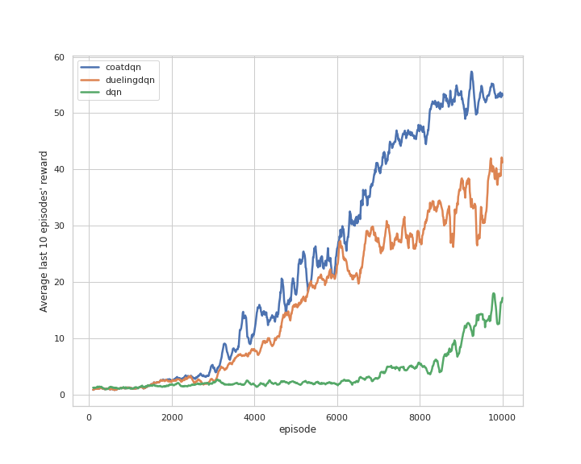

# beat-dqn

## What is this
We propsoe CoatNet based Deep Q network which outperforms previous DQN typed models. The experiment was done on Breakout environment of Atari games.
Based on our experimentation, CoAt-DQN performs way better than the baseline models DQN and Dueling DQN.
We also run this code on Multi GPU environment and Slurm based clusters, so include code for that purpose as well.

## Installation
You are recommended to setup anaconda environment for this project.

    conda create -n beat-dqn python=3.7.15
    conda activate beat-dqn

Install the dependencies.

    conda install -y -c conda-forge pytorch
    conda install -y -c conda-forge torchvision
    conda install -y -c conda-forge gym-atari
    conda install -y -c conda-forge celluloid
    conda install -y tqdm

Or, you can use `pip` to install the dependencies. (But conda install is recommended.)

    pip install -r requirements.txt

## How to run on RC
YOu have to choose a cluster to run the code. The code is tested on the `gpu` cluster. You can run the code on the `gpu` cluster by

    sbatch run.sh

## How to run on your local machine
You can run the code on your local machine by

    python main.py -h # for checking the possible arguments
    python main.py # Run with default settings (model=dqn, size=96, goal=episode, goalvalue=1000)
    python main.py --model dqn(dqn, duelingdqn, coatdqn) # Specify the model
    python main.py --model dqn --goal episode(episode, reward) --goalvalue 1000(15 if the goal is reward) # Specify the goal
    python main.py --multigpu True # Using multi GPU
